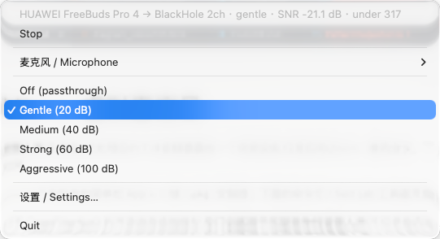
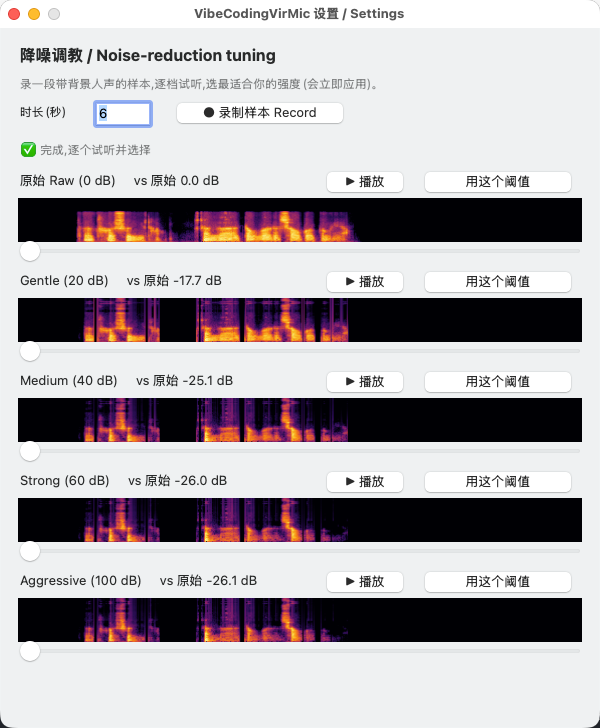
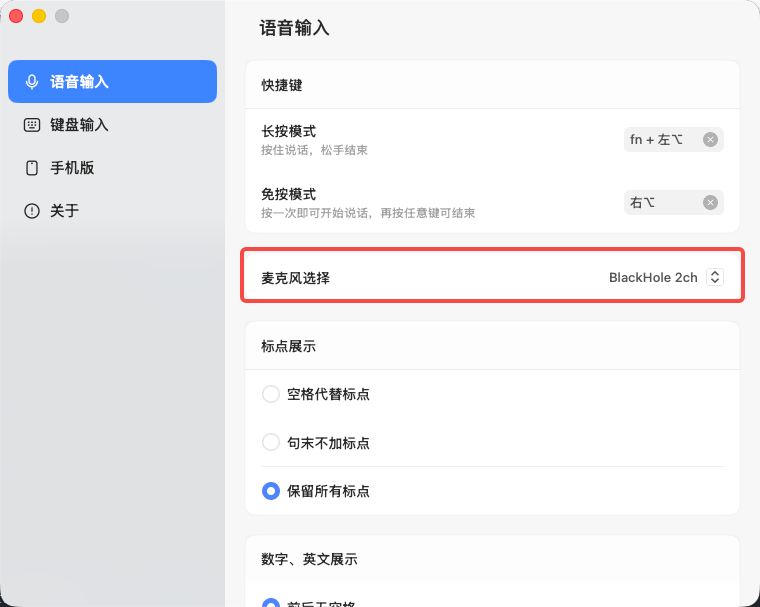

# VibeCodingVirMic — 虚拟麦克风

一个 macOS 虚拟麦克风,实时**去除背景人声**(及噪音),把处理后的干净音频暴露成一个音频设备,任意应用(Zoom、腾讯会议、飞书、Teams、Discord、豆包语音输入法、QuickTime 等)都能把它选作麦克风。

> 交付形态是 **VibeCodingVirMic** —— 一个自包含的菜单栏 App + 一键 `.pkg` 安装器。下面的命令行 / Test Lab 工具是开发用的。

底层模型是 [**Hush**](https://huggingface.co/weya-ai/hush)(`weya-ai/hush`),基于 DeepFilterNet3 的开源语音增强模型,**专门训练用于压制竞争性背景人声**(不仅是稳态噪音)。16 kHz、约 20 ms 延迟、全因果、纯 CPU。

```
物理麦克风 ─▶ 采集 ─▶ Hush 降噪 ─▶ 环形缓冲 ─▶ BlackHole 2ch ─▶ 会议/输入法
                     (去背景人声)              (虚拟声卡)        (选它当麦克风)
```

## 快速上手 —— 从安装到使用

> 这一节是给**使用者**的完整流程:拿到安装包 → 装好 → 选好降噪 → 在任意 App 里用它当麦克风。后面各节是命令行 / Test Lab / 打包等**开发**用的内容。

整条链路是:**物理麦克风 → VibeCodingVirMic 去背景人声 → BlackHole 2ch(虚拟声卡)→ 你的会议 / 输入法**。你要做的只有两件事:在本 App 里选好降噪,再把目标 App 的麦克风设成 *BlackHole 2ch*,其余交给它。

### 第 1 步 · 安装

需要一台 **Apple Silicon** 的 Mac。安装包就在本仓库的 **[`./dist/`](./dist/)** 目录(各版本下载与更新记录见 [`dist/README.md`](./dist/README.md))。拿到 `VibeCodingVirMic-Installer-1.0.0.pkg`,双击打开。因为暂未做 Apple 公证,Gatekeeper 首次会拦 —— **右键 .pkg → 打开** 即可(或在终端跑 `sudo installer -pkg VibeCodingVirMic-Installer-1.0.0.pkg -target /`)。安装过程要输入一次管理员密码(macOS 安装音频驱动时必需)。安装器会一并装好 App、全部依赖,以及 BlackHole 2ch 虚拟声卡。

### 第 2 步 · 打开 App 并启动

从「应用程序」打开 **VibeCodingVirMic**,菜单栏出现 `● VCVMic` 图标(`●` 运行中 / `○` 已停止)。点 **Start** 启动虚拟麦克风。首次会弹出 macOS *麦克风权限* 提示 —— **务必允许**,否则输入是静音的。

### 第 3 步 · 选麦克风、选降噪强度

点菜单栏图标展开菜单:

- 在 **麦克风 / Microphone** 子菜单里选你的物理麦克风(列表已自动排除 BlackHole,以免形成回环);
- 选一个**降噪强度档位**:**Off(直通)/ Gentle(20 dB)/ Medium(40 dB)/ Strong(60 dB)/ Aggressive(100 dB)**。日常从 **Gentle** 起步,背景人声越大就往上调。

顶部状态行会显示 `麦克风 → 输出 · 档位 · SNR · 欠载次数`,可据此确认链路工作正常。麦克风和档位都会被记住,下次自动沿用。



### 第 4 步 ·(可选)用「降噪调教」挑最合适的档位

拿不准选哪一档?点 **设置 / Settings…** 打开设置窗口里的「**降噪调教**」:

1. 点「**录制样本**」(带倒计时),录制时**一边说话一边播放背景人声**,模拟真实场景;
2. 录完后会列出 **原始 / Gentle / Medium / Strong / Aggressive** 五个版本,各带频谱图、**▶ 播放** 按钮和「vs 原始」的 dB 降幅,逐个试听对比;
3. 听到满意的那档,点它的「**用这个阈值**」→ 立即应用,菜单栏里对应档位打勾。



### 第 5 步 · 在目标 App 里把麦克风选成 BlackHole 2ch

最后一步:在你要用的 App(Zoom、腾讯会议、飞书、Teams、Discord、豆包语音输入法、QuickTime 等)的麦克风设置里,把麦克风**选成 `BlackHole 2ch`**。

下图以**豆包输入法**为例 —— 在「语音输入 → 麦克风选择」里选 **BlackHole 2ch**(它就是本 App 安装的那个虚拟麦克风):



选好后,这个 App 听到的就是 VibeCodingVirMic 已去掉背景人声的干净音频。完成 ✅

---

## 环境要求(从源码开发 / 构建)

> 只用安装包的使用者无需关心以下内容,装好 `.pkg` 即可;这里是从源码运行 / 自己打包时的要求。

- **Apple Silicon** 的 macOS(内置的 `libweya_nc.dylib` 仅 arm64)。
- [Homebrew](https://brew.sh)。
- Python 3.9+(系统自带的 `python3` 即可)。

## 安装(开发环境)

```bash
bash setup.sh
```

会安装 **BlackHole 2ch**(虚拟声卡,需要输入密码)、**PortAudio**、一个带 `numpy` + `sounddevice` 的 Python venv,并对模型库去隔离、跑一遍离线流水线测试确认一切正常。

## 运行

### 菜单栏 App(推荐)

```bash
.venv/bin/python src/menubar.py
```

菜单栏出现 `● VCVMic` 图标(`●` 运行中 / `○` 已停止 —— 栏上显示短名 **VCVMic**,完整产品名是 VibeCodingVirMic):

- **Start / Stop** 启停虚拟麦克风。
- **麦克风 / Microphone** 子菜单 —— 选物理麦克风(自动排除 BlackHole 以免形成回环)。选择会被记住。
- **热插拔感知** —— 一个 CoreAudio 监听器实时响应设备变化:
  - 拔掉**正在用的**麦克风(比如断开蓝牙耳机)→ 自动切到系统默认麦克风,继续工作;
  - 插入**新**麦克风 → 出现在列表里,当前用的麦克风不变;
  - (刷新设备列表需重置 PortAudio,所以插拔的一瞬间有极短中断 —— 这是 macOS 的硬限制。)
- **降噪强度档位**(可随时切换):**Off(直通)** · **Gentle(20 dB)** · **Medium(40 dB)** · **Strong(60 dB)** · **Aggressive(100 dB)**。
- **设置 / Settings…** → 弹出**原生设置窗口**,内含「降噪调教」section:录一段带背景音的样本,逐档试听对比,点「用这个阈值」即应用(见下)。
- 状态行显示 `麦克风 → 输出 · 档位 · SNR · 欠载次数`。

麦克风选择 + 档位会持久化到 `~/Library/Application Support/VibeCodingVirMic/config.json`。没有保存时自动选系统默认麦克风(绝不会选 BlackHole)。`VMIC_INPUT` / `VMIC_OUTPUT` 环境变量仍可覆盖。

### 降噪调教(设置窗口里的 section)

点菜单栏 **设置 / Settings…** 打开原生窗口 → **降噪调教**:

1. 点「**录制样本**」(带倒计时),录制时**同时说话 + 播放背景人声**;
2. 录完后列出 **原始 / 20 / 40 / 60 / 100 dB** 五个版本,各带 **▶ 播放** 按钮,逐个试听对比;
3. 点某档的「**用这个阈值**」→ 立即应用到虚拟麦克风,菜单栏对应档位打勾。

(录制时会短暂停掉引擎借用麦克风,录完自动恢复。窗口按多 section 结构搭建,后续可加入更多 section。)

### 命令行

```bash
.venv/bin/python src/vmic.py
```

无论哪种方式,运行后在会议/输入法里把麦克风选成 **"BlackHole 2ch"**(同上面「快速上手」第 5 步)。

> **首次运行**会触发 macOS *麦克风权限* 提示 —— 允许它,否则输入是静音的。

### 用原始硬件麦克风(推荐)

你的系统默认麦克风可能本身就是个降噪虚拟设备(如 *krisp microphone*)。为了让 Hush 拿到未处理的硬件麦克风、避免叠加处理:

```bash
.venv/bin/python src/vmic.py --input-device "MacBook Pro"
```

### 命令行参数

| 参数 | 默认 | 说明 |
|------|------|------|
| `--input-device` | 系统默认麦克风 | 麦克风序号或名称片段 |
| `--output-device` | 第一个 `BlackHole` | 输出设备序号或名称片段 |
| `--atten-lim-db` | `100` | 最大压制 dB。`100` = 最强;`40` 让自己声音更自然,`20` 更轻 |
| `--samplerate` | `48000` | 需与 BlackHole 采样率一致(见「音频 MIDI 设置」) |
| `--passthrough` | 关 | 绕过 Hush,直通麦克风,用于 A/B 测试路由 |
| `--list-devices` | — | 打印所有音频设备并退出 |

按 **Ctrl+C** 停止。守护进程会实时打印帧数和 SNR 估计。

## Test Lab(浏览器里录制对比 —— 开发工具)

一个本地网页,用来录制 A/B 测试、对比原始 vs Hush 处理后的音频:

```bash
.venv/bin/python src/testlab.py      # 服务于 http://localhost:8675
open http://localhost:8675
```

- **录制** —— 选时长 + 强度 + 标签,点录制并说话。同时采集原始麦克风和 Hush 处理后的同一段音频。
- **测试** —— 每条测试存到 `recordings/<时间戳-标签>/`(`raw.wav`、`processed.wav`、`meta.json`)。选一条对比。
- **对比** —— 每条测试显示两条**波形**(原始橙 / 处理后绿)、两个**播放器**(播一个自动暂停另一个,方便 A/B)、以及指标(电平变化、差异 RMS、设备)。

录制器直接读物理麦克风,与虚拟麦克风是否运行无关(若麦克风被占用,先停掉菜单栏 App)。可用 `VMIC_INPUT` 环境变量覆盖麦克风。

## 验证

离线(无需设备)—— 把内置样本过一遍 Hush,逐位比对官方参考去噪结果(在文档记载的 160 采样延迟处):

```bash
.venv/bin/python tests/test_pipeline.py        # -> PASS  ref_corr@160=1.0000
```

对任意 WAV 降噪听效果:

```bash
.venv/bin/python src/denoise_file.py --input assets/sample_00006_raw.wav \
                                     --output /tmp/cleaned.wav
```

端到端实测:打开 **Photo Booth** 或 **QuickTime → 新建音频录制**,把声源选成 *BlackHole 2ch*,一边放有人说话的视频一边自己讲话,确认背景人声被去掉。

## 工作原理

- **`src/engine.py`** —— `VMicEngine`:可控的流水线。两条独立的 `sounddevice` 流(麦克风输入、输出),用线程安全的环形缓冲解耦。这种跨设备路由方式不会出现"单条双工流在输入输出为不同物理设备时"的掉帧。每 10 ms 一帧在输入回调里降噪(Hush 单帧 <1 ms)。切档位会实时重建会话;直通则绕过模型。`set_input()` 实时切换麦克风(停 → 重建 → 启)。
- **`src/vmic.py`** —— 引擎之上的轻量命令行。
- **`src/menubar.py`** —— 基于 `rumps` 的菜单栏 App:麦克风选择、档位、配置持久化、热插拔处理、设置入口。
- **`src/devicewatch.py`** —— CoreAudio(在 `kAudioHardwarePropertyDevices` 上 `AudioObjectAddPropertyListener`)热插拔监听器;回调只置标志,菜单栏主线程定时器做重置 / 重建 / 重启。
- **`src/settingswindow.py`** —— 原生 AppKit 设置窗口(多 section 结构),目前含「降噪调教」section。
- **`src/tuning.py`** —— 调教核心(UI 无关):录一段并在各档位渲染。
- **`src/denoise_file.py`** —— 离线文件→文件降噪;模型概念验证。
- **`vendor/weya_nc.py`** —— 上游对 Weya NC C 库的 ctypes 封装(Apache-2.0)。该库内部把你的采样率 ↔ 模型原生 16 kHz 互相重采样,无需 Python 端处理。
- **`vendor/lib/libweya_nc.dylib`**、**`vendor/models/*.tar.gz`** —— 预编译的 Hush 推理库 + ONNX 模型包(运行时无需 PyTorch)。

## 常见问题

| 现象 | 解决 |
|------|------|
| 爆音 / 掉帧 | 确认「音频 MIDI 设置」里 BlackHole 采样率与 `--samplerate`(48000)一致。可调大抖动缓冲(`vmic.py` 里的 `JITTER_FRAMES`)。 |
| 没有声音(输出) | 给终端授予麦克风权限(系统设置 → 隐私与安全性 → 麦克风)。检查 `--list-devices`。**另外:别把系统"输出"设备设成 BlackHole,否则播放声音会进黑洞。** |
| `dylib` 加载失败 | 重新跑 `xattr -dr com.apple.quarantine vendor/lib/libweya_nc.dylib`。 |
| 自己声音听着被处理过头 | 降低 `--atten-lim-db`(如 `40`)。 |
| 音频被双重处理 | 用 `--input-device "MacBook Pro"` 绕过其它虚拟麦克风。 |

## 打包成可分发的安装器

生成一个单文件 `.pkg`,在另一台 Apple Silicon Mac 上一次装好(App + 全部依赖 + BlackHole 驱动):

```bash
bash packaging/build_app.sh    # -> dist/VibeCodingVirMic.app(自包含,临时签名)
bash packaging/build_pkg.sh    # -> dist/VibeCodingVirMic-Installer-1.0.0.pkg
```

- **`build_app.sh`** 跑 PyInstaller(`packaging/VibeCodingVirMic.spec`),把 Python 运行时、numpy、sounddevice(含自带 PortAudio)、rumps/PyObjC、Hush 的 `libweya_nc.dylib` 和 ONNX 模型全打进去 —— 目标 Mac 无需任何外部依赖。然后临时签名并跑 `--selftest`。
- **`build_pkg.sh`** 把 App + BlackHole 驱动打进一个 `.pkg`。`postinstall` 将驱动装到 `/Library/Audio/Plug-Ins/HAL/`、清除 App 隔离属性、重启 CoreAudio。
  - **已禁用重定位**(`pkgbuild --component-plist` 里 `BundleIsRelocatable=false`)。否则 pkgbuild 默认的 `<relocate>` 会把 App 装到 LaunchServices 里已登记的旧位置而非 `/Applications` —— 这是我们踩过并修掉的真实 bug。

### App 图标

图标源是 `packaging/icon-source.png`。`packaging/make_icon.py` 裁掉白边、补成正方形、套 macOS 圆角 alpha 蒙版,产出 `packaging/AppIcon.icns`(通过 spec 的 `icon=` 嵌入 App)和 `packaging/AppIcon.png`。`build_pkg.sh` 再用 `packaging/set_pkg_icon.py`(NSWorkspace)把该 PNG 设为 `.pkg` 的 Finder 图标。改了源图后重新生成:

```bash
.venv/bin/python packaging/make_icon.py packaging/icon-source.png packaging
```

菜单栏显示短名 **VCVMic**(`src/menubar.py` 里的 `MENU_NAME`);bundle、安装器、对话框用完整名 **VibeCodingVirMic**。

### 启动性能

- **延迟导入** —— `menubar.py` 在模块加载时不导入 `engine`/numpy/sounddevice;菜单栏图标立即出现,首次设备扫描推迟到第一个定时器 tick(约 1 秒,期间显示「扫描中…」)。Hush 模型只在 **Start** 时加载。这是主要的提速点,对每次启动都有效。
- spec 里的 **strip + excludes** 会精简二进制,但包体被约 25 MB 的模型+库(不可压缩)和 numpy/Python 运行时占住,所以只减约 1 MB。它是 onedir(无每次解压开销)。
- 剩下的**首次启动延迟**是 macOS Gatekeeper 校验这个临时签名(未公证)的 50 MB 包 —— 一次性开销,之后启动很快。根治方法是**公证**(需要 Apple Developer ID,见下)。

运行很轻:加载 dylib + 8 MB ONNX 模型并处理一帧约 0.18 秒;推理纯 CPU(ONNX Runtime 静态链入 Rust 的 `libweya_nc.dylib`,无 GPU/CoreML)。

### 在另一台 Mac 上安装

1. 把 `VibeCodingVirMic-Installer-1.0.0.pkg` 拷过去打开(需要一次管理员密码 —— macOS 要求安装音频驱动时如此)。
2. **未做 Apple 公证**(无 Developer ID),Gatekeeper 首次打开会拦。要么**右键 .pkg → 打开**,要么:
   ```bash
   sudo installer -pkg VibeCodingVirMic-Installer-1.0.0.pkg -target /
   ```
3. 从「应用程序」打开 **VibeCodingVirMic** → Start → 授予麦克风权限 → 在 **麦克风 / Microphone** 子菜单选你的麦克风 → 在会议/输入法里把麦克风选成 **BlackHole 2ch**。

> 要做到任意 Mac 上双击零警告安装,需用 Apple Developer ID 签名并公证 —— 在 `build_pkg.sh` 前对 `dist/VibeCodingVirMic.app` 跑 `codesign`/`notarytool`,再对最终 `.pkg` 跑 `notarytool` + `stapler`。

**构建所需:** Apple Silicon、跑过一次开发安装(`bash setup.sh`,使本机有 BlackHole 可打包)、以及 PyInstaller(`pip install pyinstaller`)。

## 致谢

- 模型:[weya-ai/hush](https://huggingface.co/weya-ai/hush) · 代码:[pulp-vision/Hush](https://github.com/pulp-vision/Hush) —— Apache-2.0。
- 虚拟声卡:[BlackHole](https://github.com/ExistentialAudio/BlackHole)。
